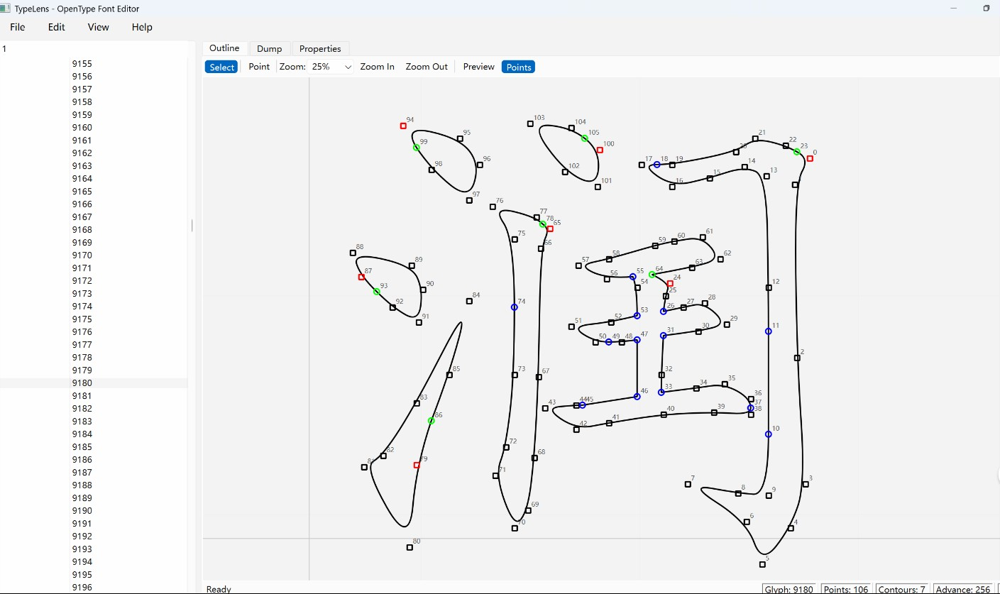

# TypeLens - OpenType Font Editor

## Project Overview

**TypeLens** is a professional OpenType font viewing and editing tool that supports TTF, TTC, OTF, and DFont font formats. This project is developed in Python with a modern PyQt6 user interface.

## Project Architecture

### 1. Overall Architecture Design

```
TypeLens
├── Core Module (psource/core/ot)
│   ├── OTFontCollection - Font collection management
│   ├── OTFont - Single font management
│   ├── Glyph - Glyph data model
│   ├── Point - Coordinate point model
│   └── Fixed - Fixed-point arithmetic
│
├── Table Parsing Module (psource/core/ot/table)
│   ├── TableDirectory - Table directory
│   ├── DirectoryEntry - Directory entry
│   ├── GlyfTable - Glyph table
│   ├── LocaTable - Glyph location table
│   ├── HeadTable - Font header table
│   ├── HheaTable - Horizontal header table
│   ├── HmtxTable - Horizontal metrics table
│   ├── MaxpTable - Maximum profile table
│   ├── CmapTable - Character mapping table
│   ├── NameTable - Naming table
│   ├── Os2Table - OS/2 table
│   └── CvtTable - Control value table
│
├── UI Module (psource/ui)
│   ├── MainWindow - Main window
│   ├── GlyphEditor - Glyph editor panel
│   ├── GlyphPanel - Glyph panel
│   ├── TableTreeBuilder - Tree structure builder
│   └── widgets/ - UI components
│       ├── GlyphToolbar - Edit toolbar
│       ├── GlyphStatusBar - Status bar
│       └── EditorMenu - Menu system
│
└── Export Module (psource/export)
    └── SVGExporter - SVG export implementation
```

### 2. Design Patterns

#### 2.1 Factory Pattern
- **TableFactory**: Creates table instances based on table type

#### 2.2 Composite Pattern
- **TableTreeBuilder**: Builds tree structure to display font table hierarchy

#### 2.3 Strategy Pattern
- **GlyphDescription**: Different glyph description strategies (simple/composite)

#### 2.4 MVC Pattern
- **Model**: OTFont, Glyph, Table and other data models
- **View**: GlyphEditor, QTreeView, QTableWidget and other views
- **Controller**: MainWindow, GlyphToolbar and other controllers

## Core Algorithms

### 1. OpenType Font Parsing Algorithm

#### 1.1 Font Format Identification

```python
def identify_font_format(file_path):
    """
    Identify font file format
    1. Check file extension
    2. Read file header to determine type
    3. Supported formats: TTF, TTC, OTF, DFont
    """
    # Read first 4-12 bytes
    # Check if it's TTC (TrueType Collection)
    # Check if it's Mac DFont resource fork
```

#### 1.2 Table Directory Parsing Algorithm

```
Algorithm: TableDirectory.read()
1. Read version number (sfnt version)
2. Read table count (numTables)
3. Read search parameters (searchRange, entrySelector, rangeShift)
4. Loop to read numTables DirectoryEntry objects
   - Each Entry contains: tag, checksum, offset, length
5. Create corresponding table instance based on tag
```

**Key Data Structure**:
```python
class DirectoryEntry:
    tag: int          # 4-byte tag (e.g., 'glyf' = 0x676C7966)
    checksum: int     # Checksum
    offset: int       # Table data offset
    length: int       # Table data length
```

#### 1.3 Glyph Table Parsing Algorithm

```
Algorithm: GlyfTable.init(numGlyphs, loca)
1. Use LocaTable to locate each glyph
2. Read numberOfContours to determine type:
   - >= 0: Simple Glyph
   - < 0: Composite Glyph
3. Simple glyph parsing:
   - Read contour count and bounding box
   - Read end point indices array (endPtsOfContours)
   - Read flags array
   - Read coordinate arrays (xCoordinates, yCoordinates)
4. Composite glyph parsing:
   - Read component flags
   - Recursively parse component glyphs
```

### 2. Bezier Curve Rendering Algorithm

#### 2.1 Outline Construction

```python
def build_path(glyph):
    """
    Convert glyph points to Qt QPainterPath
    Using Quadratic Bezier curves
    
    Algorithm:
    For each point in the outline:
    1. Determine current and next point types
    2. Determine curve type based on point types:
       - OnCurve + OnCurve: Straight line
       - OnCurve + OffCurve + OnCurve: Quadratic Bezier
       - OffCurve + OffCurve: Insert implicit OnCurve point
    3. Transform coordinates (Y-axis flip)
    """
```

#### 2.2 Bezier Curve Interpolation

```python
def quadratic_bezier(p0, p1, p2, t):
    """
    Quadratic Bezier curve formula:
    B(t) = (1-t)²P0 + 2(1-t)tP1 + t²P2
    
    Where:
    - P0: Start point (OnCurve)
    - P1: Control point (OffCurve)
    - P2: End point (OnCurve)
    - t: Parameter [0, 1]
    """
    return (1-t)*(1-t)*p0 + 2*(1-t)*t*p1 + t*t*p2
```

### 3. Fixed-Point Arithmetic

OpenType uses 16.16 fixed-point format for decimals:

```python
class Fixed:
    """
    16.16 fixed-point format
    High 16 bits: Integer part
    Low 16 bits: Fractional part
    
    Examples:
    0x00010000 = 1.0
    0x00008000 = 0.5
    0x0000C000 = 0.75
    """
    
    @staticmethod
    def float_value(fixed_int):
        return fixed_int / 65536.0
    
    @staticmethod
    def int_value(float_val):
        return int(float_val * 65536)
```

### 4. Coordinate Scaling Algorithm

```python
def scale_glyph(glyph, factor):
    """
    Glyph scaling algorithm (for preview)
    
    Note: Use shift operations to maintain precision
    Formula: new_value = (old_value << 10) * factor >> 26
    
    This avoids floating-point operations,
    maintaining 26-bit intermediate precision
    """
    # X coordinate scaling
    new_x = (old_x << 10) * factor >> 26
    # Y coordinate scaling
    new_y = (old_y << 10) * factor >> 26
    # Metrics scaling
    new_lsb = (old_lsb * factor) >> 6
    new_advance = (old_advance * factor) >> 6
```

## Data Structures

### 1. Core Data Structures

#### Point
```python
class Point:
    x: int          # X coordinate
    y: int          # Y coordinate
    on_curve: bool  # Whether on curve (True=OnCurve, False=OffCurve)
    end_of_contour: bool  # Whether end of contour
```

#### Glyph
```python
class Glyph:
    points: List[Point]       # All points of the glyph
    advance_width: int        # Advance width
    left_side_bearing: int     # Left side bearing
    
    def get_point_count() -> int
    def scale(factor: float)
```

#### Table (Base Class)
```python
class Table:
    directory_entry: DirectoryEntry
    type: int  # Table type tag
    
    def get_type() -> int
    def get_directory_entry() -> DirectoryEntry
```

### 2. OpenType Table Types

| Table Name | Tag | Purpose |
|------------|-----|---------|
| cmap | 0x636D6170 | Character to glyph index mapping |
| glyf | 0x676C7966 | Glyph outline data |
| head | 0x68656164 | Font header information |
| hhea | 0x68686561 | Horizontal header (metrics) |
| hmtx | 0x686D7478 | Horizontal metrics |
| loca | 0x6C6F6361 | Glyph location index |
| maxp | 0x6D617870 | Maximum profile |
| name | 0x6E616D65 | Naming table |
| OS/2 | 0x4F532F32 | OS/2 and Windows specific metrics |
| post | 0x706F7374 | PostScript information |
| cvt | 0x63767420 | Control value table |
| fpgm | 0x6670676D | Font program |
| gasp | 0x67617370 | Grid-fitting/Scan conversion |
| kern | 0x6B65726E | Kerning |
| prep | 0x70726570 | Control value program |
| GPOS | 0x47504F53 | Glyph positioning |
| GSUB | 0x47535542 | Glyph substitution |

## Functional Modules

### 1. Font File Loading

#### 1.1 Single Font File (TTF/OTF)
```python
def load_single_font(file_path):
    # 1. Open file stream
    # 2. Read Table Directory
    # 3. Parse all tables
    # 4. Create OTFont object
```

#### 1.2 Font Collection (TTC)
```python
def load_font_collection(file_path):
    # 1. Read TTC Header
    # 2. Get directory count
    # 3. Create OTFont instance for each directory
```

#### 1.3 Mac DFont
```python
def load_dfont(file_path):
    # 1. Read resource header
    # 2. Parse resource map
    # 3. Find 'sfnt' resource type
    # 4. Extract font data and parse
```

### 2. Glyph Editing

#### 2.1 Point Editing
- **PointTool**: Control point dragging
- **SelectCommand**: Point selection
- **Supported Features**:
  - Single point selection
  - Multi-point selection (Ctrl+Click)
  - Point dragging
  - Control point editing

#### 2.2 View Controls
- **Zoom**: Mouse wheel zoom
- **Pan**: Canvas dragging
- **Grid**: Show/hide guidelines

### 3. Export Functions

#### 3.1 SVG Export
```python
class SVGExporter:
    def export(font, output_stream):
        # 1. Create SVG document header
        # 2. Define viewport
        # 3. Generate <path> elements for each glyph
        # 4. Use path building logic
        # 5. Transform coordinates to SVG coordinate system
```

#### 3.2 Export Options
- Export all glyphs or selected glyphs
- Set export scale factor
- Custom viewport size

### 4. User Interface

#### 4.1 Main Window Layout
```
┌──────────────────────────────────────┐
│ Menu Bar                            │
├────────────┬─────────────────────────┤
│            │  TabbedPane             │
│ QTreeView  │  ┌─────────────────┐   │
│ (Font table│  │ GlyphEdit Panel  │   │
│  tree)     │  │ (Glyph editing) │   │
│            │  ├─────────────────┤   │
│            │  │ Dump Panel       │   │
│            │  │ (Hex dump)       │   │
│            │  └─────────────────┘   │
├────────────┴─────────────────────────┤
│ Status Bar                          │
└──────────────────────────────────────┘
```

#### 4.2 Menu Structure
- **File**: Open, Save, Export, Close
- **Edit**: Undo, Redo, Copy, Paste
- **View**: Preview, Show control points, Zoom
- **Help**: About

#### 4.3 Preferences
- Window position and size
- Split panel position
- Recent files list
- User custom properties

## Technology Stack

- **Language**: Python 3.8+
- **UI Framework**: PyQt6
- **Graphics**: Qt Graphics View Framework
- **Package Management**: pip
- **Optional**: numpy (numerical computation), Pillow (image processing)

## File Format Details

### 1. TrueType Outline Format

TrueType uses quadratic Bezier curves to describe glyph outlines:

```
Outline point sequence:
[On1] [Off1] [Off2] [On2] [On3] [Off3] [Off4] [On4]

Curve segments:
1. On1 → (Off1, Off2) → On2  (Quadratic Bezier)
2. On2 → On3          (Straight line)
3. On3 → (Off3, Off4) → On4  (Quadratic Bezier)
```

**Point Flags**:
- Bit 0: On Curve (1=OnCurve, 0=OffCurve)
- Bit 1: X Short Vector
- Bit 2: Y Short Vector
- Bit 3: Repeat
- Bit 4: X Same/Short
- Bit 5: Y Same/Short

### 2. Composite Glyphs

Composite glyphs consist of multiple simple glyphs:

```
Component flags:
bit 0: ARG_1_AND_2_ARE_WORDS
bit 1: ARGS_ARE_XY_VALUES
bit 5: WE_HAVE_A_SCALE
bit 8: WE_HAVE_AN_X_AND_Y_SCALE
bit 9: WE_HAVE_A_TWO_BY_TWO
```

### 3. Character Mapping (cmap)

Supports multiple mapping formats:

- **Format 0**: 256-byte mapping table
- **Format 2**: Segment mapping (multi-byte encoding)
- **Format 4**: Segment mapping (Unicode)
- **Format 6**: Trimmed mapping table

## Performance Optimization

### 1. Caching Strategy
- Glyph path caching (avoid rebuilding)
- Image caching
- Table data caching

### 2. Lazy Loading
- On-demand table data parsing
- Virtualized tree view

### 3. Graphics Optimization
- Double buffering
- Dirty rectangle redraw
- Batch rendering

## Extensibility Design

### 1. Table Factory Pattern
```python
class TableFactory:
    TABLE_TYPES = {
        0x636D6170: CmapTable,
        0x676C7966: GlyfTable,
        0x68656164: HeadTable,
        # ... other table types
    }
    
    @staticmethod
    def create(entry, data_input):
        return TABLE_TYPES[entry.tag](entry, data_input)
```

### 2. Exporter Pattern
```python
class Exporter:
    def export(self, font, output_stream):
        raise NotImplementedError

class SVGExporter(Exporter):
    def export(self, font, output_stream):
        # SVG specific implementation
```

### 3. Tool Pattern
```python
class Tool:
    def pressed(self, point): pass
    def dragged(self, point): pass
    def released(self, point): pass

class PointTool(Tool):
    # Point editing implementation

class SelectTool(Tool):
    # Selection tool implementation
```

## Testing Strategy

### 1. Unit Testing
- Table parsing correctness
- Mathematical operation precision
- Path building algorithm

### 2. Integration Testing
- Font file loading
- UI interaction flow
- Export functionality

### 3. Compatibility Testing
- Multiple font formats
- Different operating systems
- Python version compatibility

## Usage Examples

```bash
# Install dependencies
pip install -r requirements.txt

# Run
python psource/main.py

# Or use startup script
python run_typeLens.py

# Package as executable
pyinstaller --onefile psource/main.py
```

## Project Structure

```
typecast.py/
├── psource/               # Python source code
│   ├── core/              # Core modules
│   │   └── ot/            # OpenType parsing
│   │       ├── table/     # Table implementation
│   │       ├── glyph.py   # Glyph class
│   │       ├── point.py   # Point class
│   │       ├── fixed.py   # Fixed-point class
│   │       ├── otfont.py  # Font class
│   │       └── otfont_collection.py  # Font collection class
│   ├── export/            # Export functions
│   ├── resources/         # Resource files
│   ├── ui/                # UI module
│   │   ├── main_window.py
│   │   └── widgets/       # UI components
│   ├── main.py            # Entry point
│   ├── test.py            # Test script
│   └── fix_imports.py     # Import fix utilities
├── requirements.txt       # Dependencies
├── run_typeLens.py       # Startup script
├── simkai.ttf            # Sample font file
├── README.md             # Documentation
├── INSTALL.md            # Installation guide
└── QUICKSTART.md         # Quick start guide
```

## License

MIT

## Author

Yuming Xu

---

## References

- [OpenType Specification 1.9](https://docs.microsoft.com/en-us/typography/opentype/spec/)
- [TrueType Reference Manual](https://developer.apple.com/fonts/TrueType-Reference-Manual/)
- [Qt Graphics View Framework](https://doc.qt.io/qt-6/graphicsview.html)
- [PyQt6 Official Documentation](https://www.riverbankcomputing.com/static/Docs/PyQt6/)
